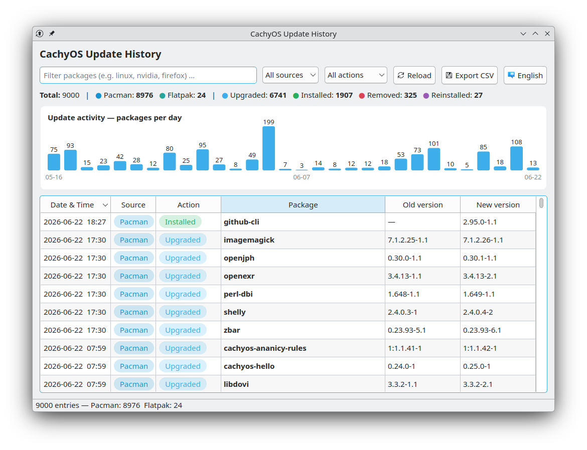

# CachyOS Update History

A small, dependency-light **PyQt6** desktop app that brings your package update
history from **Pacman**, the **AUR** and **Flatpak** into a single, sortable
view — with colored badges and a per-day activity chart.

Built for [CachyOS](https://cachyos.org/), but works on any Arch-based system
(Arch, EndeavourOS, Manjaro, …) and degrades gracefully elsewhere.


[](https://github.com/fenvarien/cachy-update-history/releases/latest)

> 🎉 **v1.0.0 is out!** First stable release — Pacman, AUR and Flatpak history
> in one view, with security hardening throughout.
> See the [release notes](https://github.com/fenvarien/cachy-update-history/releases/tag/v1.0.0).



## Features

- **Three sources in one place** — Pacman / official repos, AUR and Flatpak,
  each marked with its own colored badge.
- **Filter by text, source and action** — all three combine; filtering is
  instant even on large logs (it runs through Qt's view proxy, not a rebuild).
- **Activity chart** — a packages-per-day bar chart that follows the active
  filter (pure `QPainter`, no extra dependencies).
- **Sortable columns** — click any header; the date column sorts chronologically.
- **CSV export** of the current (filtered + sorted) view.
- **Language switching** — toggle between English and German at runtime; the
  chosen language is remembered across restarts.
- **Theme-aware** — semi-transparent badges and palette-based colors look right
  on both light and dark KDE/Breeze themes.

## How the sources are detected

| Source  | Where the data comes from |
|---------|--------------------------|
| Pacman  | Parsed from `/var/log/pacman.log` (`[ALPM]` upgrade/install/… lines). |
| AUR     | A pacman-log entry is flagged as AUR when the package is **currently** installed as a *foreign* package (`pacman -Qmq`). |
| Flatpak | Combined from `flatpak history --system/--user` plus a fallback entry per installed app from `flatpak list` (so every app appears even if its history is empty). |

> **Note on AUR detection.** The pacman log itself does not record which
> repository a package came from. The "foreign package" heuristic is the most
> reliable signal available without an external database. The trade-off: AUR
> packages you have since *removed*, or packages that later *moved into the
> official repos*, will appear as **Pacman** in the history.

## Requirements

- Python 3.9+
- PyQt6
- Optional: `flatpak` (for the Flatpak source) and `pacman` (for AUR detection).
  If either is missing, that source is simply skipped.

`/var/log/pacman.log` is world-readable on Arch by default, so **no root /
sudo is required** to run the app.

## Security &amp; robustness

The app reads system data it does not control (logs, `flatpak`/`pacman`
output), so it is written defensively:

- **No shell injection** — external tools are invoked with explicit argument
  lists (never a shell string), so package names can't break out of a command.
- **CSV export is injection-safe** — cells beginning with `=`, `+`, `-`, `@` or
  a control character are prefixed with a quote, so a crafted package name or
  version can't be executed as a formula when the CSV is opened in Excel or
  LibreOffice.
- **Atomic config writes** — the language setting is written to a temp file and
  renamed into place, so an interrupted write can't leave a corrupt config.
- **Memory-safe log reading** — `pacman.log` is streamed line by line rather
  than loaded whole, keeping memory flat no matter how large the log grows.

## Installation

### Arch / CachyOS (recommended)

Install PyQt6 from the official repositories and run the script directly:

```bash
sudo pacman -S python-pyqt6
git clone https://github.com/fenvarien/cachy-update-history.git
cd cachy-update-history
python cachy-update-history.py
```

### Other distributions (virtual environment)

```bash
git clone https://github.com/fenvarien/cachy-update-history.git
cd cachy-update-history
python -m venv .venv
source .venv/bin/activate
pip install -r requirements.txt
python cachy-update-history.py
```

## Usage

Start the app:

```bash
python cachy-update-history.py
```

- Type in the search box to filter packages (matches the package name, source
  and action). Use the **source** and **action** dropdowns to narrow further;
  all three filters combine.
- Click a column header to sort; click again to reverse.
- **Reload** re-reads all sources; **Export CSV** saves the current view.
- **English / Deutsch** button switches the UI language at runtime.

## Desktop integration

To launch it from your application menu, copy the script somewhere stable and
install the provided desktop entry:

```bash
mkdir -p ~/.local/bin ~/.local/share/applications
cp cachy-update-history.py ~/.local/bin/
cp cachy-update-history.desktop ~/.local/share/applications/
```

Then edit the `Exec=` line in `~/.local/share/applications/cachy-update-history.desktop`
to match the path above (replace `YOUR_USERNAME`). After a few seconds the entry
"Update History" appears in your menu.

## Configuration

The log path is defined near the top of `cachy-update-history.py`:

```python
LOG_PATH = "/var/log/pacman.log"
```

Badge colors for sources and actions live in the `SOURCES` and `ACTIONS`
dictionaries right below it, so you can re-theme the app in one place.

The active language is saved to `~/.config/cachy-update-history.json` and
restored on next launch.

## Limitations

- AUR detection is a current-state heuristic (see the note above).
- Flatpak entries reflect **currently installed** apps (one row each), not a
  full per-update history. The date is the deploy directory's mtime, i.e. the
  last install/update.
- The chart shows the 30 most recent days that have activity.

## Project structure

```
cachy-update-history/
├── cachy-update-history.py        # the application (single file)
├── cachy-update-history.desktop   # optional menu launcher
├── requirements.txt
├── README.md
├── LICENSE
└── .gitignore
```

## Contributing

Issues and pull requests are welcome. The whole app is a single, commented
Python file, so it is easy to read and extend (for example: adding `apt`,
`snap`, or `npm -g` as further sources, or coloring the chart bars per source).

## License

Released under the [GNU General Public License v3.0](LICENSE).
